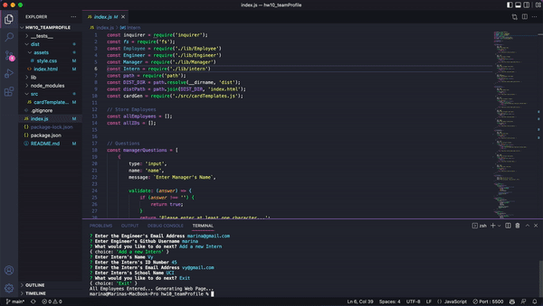

# HW 10 Object-Oriented Programming: Team Profile Generator

## Table of Contents 📚

- [Description](#description)
- [Preview](#Preview)
- [Installation](#Installation)
- [Usage](#Usage)
- [Links](#Links)

## Description 📋

Node.js command-line application that takes in information about employees on a software engineering team, then generates an HTML webpage that displays summaries for each person. 

## Preview 📸

## Installation 📥

- Copy repository to your device
- NPM install & run node index.js

## Usage 🖥

This project was designed to be utilized by teams that would like to quickly and easily input and access employee information

## Links 📍

- GitHub: https://github.com/mxhuisken/hw10_teamProfile